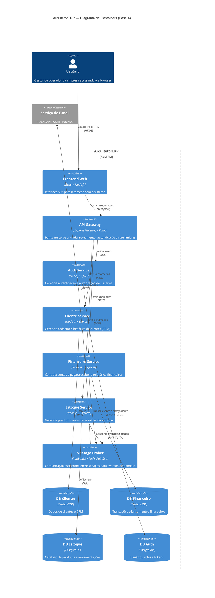

# 🏗️ ArquitetorERP — Sistema de Gestão Empresarial

> **Fase 4 — Arquitetura Cloud & Microsserviços**  
> Mini Projeto "Arquiteto Decisor" · Ciclo 3

---

## 📌 Visão Executiva

O **ArquitetorERP** é um sistema de gestão empresarial (ERP/CRM) desenvolvido ao longo do semestre com foco em modularidade, rastreabilidade de decisões arquiteturais e evolução incremental.

### Qual problema resolve?

Pequenas e médias empresas enfrentam fragmentação de informações entre setores (financeiro, clientes, estoque, RH). O ArquitetorERP centraliza esses dados em uma plataforma única, reduzindo retrabalho operacional e aumentando a visibilidade gerencial.

### Estado atual — Fase 4

Na Fase 4, o sistema foi evoluído de uma arquitetura monolítica (Fase 1) para uma arquitetura orientada a **microsserviços na nuvem**, com:

- Serviços independentes por domínio (Clientes, Financeiro, Estoque, Auth)
- Comunicação híbrida: síncrona via **API Gateway** e assíncrona via **Message Broker**
- Implantação em nuvem com suporte a **escalabilidade horizontal**
- Padrões de resiliência implementados (**Circuit Breaker**, **Bulkhead**)

---

## 🗂️ Estrutura do Repositório

```
📦 entrega.quality
 ┣ 📂 src/                        # Código-fonte dos microsserviços
 ┣ 📂 docs/
 ┃ ┣ 📂 adrs/                     # Architecture Decision Records
 ┃ ┃ ┣ 📜 0001-estrategia-nuvem.md
 ┃ ┃ ┣ 📜 0002-padrao-resiliencia.md
 ┃ ┃ ┗ 📜 0003-modelo-comunicacao.md
 ┃ ┣ 📂 sad/                      # Software Architecture Document
 ┃ ┃ ┗ 📜 sad-fase3.md
 ┃ ┗ 📂 diagrams/
 ┣ 📂 gold-plating/               # Artefatos extras (bônus)
 ┣ 📜 README.md
 ┗ 📜 .gitignore
```

---

## 📐 Diagrama C4 — Nível 2: Containers



---

## 📋 Architecture Decision Records (ADRs)

As decisões arquiteturais desta fase estão documentadas nos ADRs abaixo:

| # | Título | Status |
|---|--------|--------|
| [ADR 0001](./docs/adrs/0001-estrategia-nuvem.md) | Estratégia de Nuvem e Escalabilidade | ✅ Aceito |
| [ADR 0002](./docs/adrs/0002-padrao-resiliencia.md) | Padrões de Resiliência | ✅ Aceito |
| [ADR 0003](./docs/adrs/0003-modelo-comunicacao.md) | Modelo de Comunicação | ✅ Aceito |

O SAD completo está disponível em [`/docs/sad/sad-fase3.md`](./docs/sad/sad-fase3.md).

---

## 🚀 Como Executar Localmente

### Pré-requisitos

- Node.js v18+
- Docker e Docker Compose
- Git

### Passo a passo

```bash
# 1. Clone o repositório
git clone https://github.com/NETHOUS22/entrega.quality.git
cd entrega.quality

# 2. Instale as dependências
npm install

# 3. Suba a infraestrutura local (banco de dados + broker)
docker-compose up -d

# 4. Configure as variáveis de ambiente
cp .env.example .env
# Edite o .env com suas configurações locais

# 5. Execute os serviços
npm run dev
```

### Executar testes

```bash
npm test
```

### Executar linter

```bash
npm run lint
```

---

## 👥 Equipe

Projeto desenvolvido como parte da disciplina de Arquitetura de Software — Ciclo 3.

---

> 📄 Documentação completa em [`/docs/`](./docs/) · Artefatos extras em [`/gold-plating/`](./gold-plating/)
