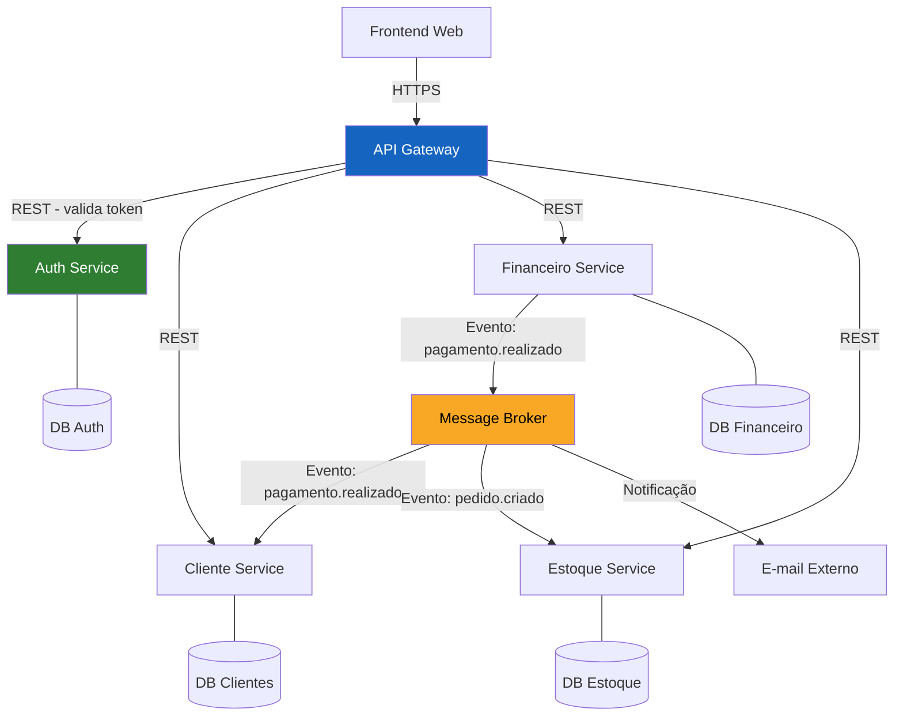
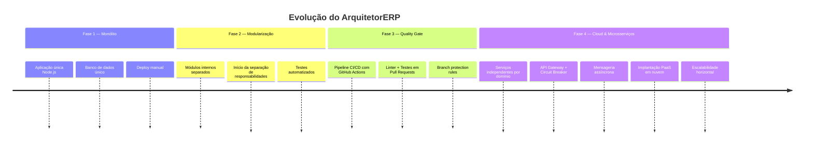

# Gold Plating — Artefatos de Excelência Técnica

> Esta pasta contém artefatos extras que vão além do mínimo exigido, demonstrando capricho técnico e maturidade arquitetural.

---

## 📋 Índice

1. [Glossário Arquitetural](#1-glossário-arquitetural)
2. [Mapa de Dependências entre Serviços](#2-mapa-de-dependências-entre-serviços)
3. [Matriz de Decisão — Escolha de Cloud](#3-matriz-de-decisão--escolha-de-cloud)
4. [Checklist de Prontidão para Produção](#4-checklist-de-prontidão-para-produção)
5. [Evolução Arquitetural: Fase 1 → Fase 4](#5-evolução-arquitetural-fase-1--fase-4)

---

## 1. Glossário Arquitetural

| Termo | Definição | Fonte |
|---|---|---|
| **Microsserviço** | Serviço pequeno, independentemente implantável, com responsabilidade única e banco de dados próprio | Newman (2021) |
| **Circuit Breaker** | Padrão que interrompe chamadas a serviços com falha, evitando cascading failures | Nygard (2018) |
| **Bulkhead** | Isolamento de recursos (threads, conexões) por serviço para conter falhas | Nygard (2018) |
| **API Gateway** | Ponto único de entrada que centraliza roteamento, autenticação e rate limiting | Richardson (2018) |
| **Event-Driven** | Arquitetura baseada em publicação e consumo de eventos de domínio | Hohpe & Woolf (2003) |
| **Consistência Eventual** | Modelo onde dados entre serviços ficam sincronizados após um tempo, não instantaneamente | Vogels (2009) |
| **Stateless** | Serviço que não armazena estado em memória entre requisições; essencial para escalabilidade horizontal | 12-Factor App |
| **Dead-Letter Queue** | Fila que recebe mensagens que falharam no processamento para análise posterior | Hohpe & Woolf (2003) |
| **Database per Service** | Padrão onde cada microsserviço possui seu próprio banco isolado | Newman (2021) |
| **PaaS** | Modelo de nuvem onde o provedor gerencia SO, runtime e infraestrutura; o time entrega apenas o código/contêiner | NIST (2011) |

---

## 2. Mapa de Dependências entre Serviços

**Legenda:**
- Setas sólidas → comunicação síncrona (REST/HTTP)
- Setas via Broker → comunicação assíncrona (eventos)
- Cada serviço possui banco de dados isolado (Database per Service)

---

## 3. Matriz de Decisão — Escolha de Cloud

Utilizada para fundamentar o ADR 0001, a matriz compara os principais modelos de implantação em nuvem para o perfil do ArquitetorERP:

| Critério | Peso | IaaS (VMs) | PaaS (Contêineres) | Serverless | Score IaaS | Score PaaS | Score Serverless |
|---|---|---|---|---|---|---|---|
| Facilidade de deploy | 25% | 2 | 5 | 4 | 0,50 | 1,25 | 1,00 |
| Custo operacional | 20% | 2 | 4 | 5 | 0,40 | 0,80 | 1,00 |
| Controle da infraestrutura | 15% | 5 | 3 | 1 | 0,75 | 0,45 | 0,15 |
| Adequação ao perfil de carga ERP | 30% | 4 | 5 | 2 | 1,20 | 1,50 | 0,60 |
| Portabilidade (sem vendor lock-in) | 10% | 5 | 4 | 2 | 0,50 | 0,40 | 0,20 |
| **Total** | **100%** | | | | **3,35** | **4,40** ✅ | **2,95** |

> **Conclusão:** PaaS com contêineres apresenta o melhor score ponderado para o perfil do ArquitetorERP, confirmando a decisão do ADR 0001.

---

## 4. Checklist de Prontidão para Produção

Baseado nos critérios de *production readiness* de **Nygard (2018)** e **Skelton & Pais (2019)**:

### Resiliência
- [ ] Circuit Breaker implementado nas chamadas entre serviços
- [ ] Timeout configurado em todas as chamadas HTTP externas
- [ ] Retry com backoff exponencial implementado
- [ ] Dead-letter queue configurada no broker
- [ ] Health check endpoint (`/health`) em cada serviço

### Observabilidade
- [ ] Logs estruturados (JSON) com correlation ID
- [ ] Métricas de latência e taxa de erro por serviço
- [ ] Dashboard de monitoramento configurado
- [ ] Alertas para Circuit Breaker aberto

### Segurança
- [ ] Autenticação JWT validada no Gateway
- [ ] Variáveis sensíveis em secrets (não em código)
- [ ] Comunicação interna via HTTPS ou rede privada
- [ ] Rate limiting configurado no Gateway

### Implantação
- [ ] Pipeline CI/CD com lint, testes e build automáticos
- [ ] Imagens Docker versionadas no registry
- [ ] Rollback automatizado em caso de falha no deploy
- [ ] Variáveis de ambiente documentadas no `.env.example`

---

## 5. Evolução Arquitetural: Fase 1 → Fase 4

### Principais mudanças da Fase 3 para a Fase 4

| Aspecto | Fase 3 (Monólito com CI) | Fase 4 (Microsserviços Cloud) |
|---|---|---|
| **Implantação** | Servidor único | PaaS com múltiplos contêineres |
| **Banco de dados** | Um banco compartilhado | Um banco por serviço (Database per Service) |
| **Escalabilidade** | Vertical (upgrade do servidor) | Horizontal (mais instâncias por serviço) |
| **Comunicação** | Chamadas internas de função | REST + Mensageria assíncrona |
| **Falha isolada** | Falha derruba tudo | Circuit Breaker isola falhas |
| **Deploy** | Downtime total no deploy | Rolling deploy sem downtime |

---

## Referências

- NYGARD, M. T. *Release It!*. 2. ed. Pragmatic Bookshelf, 2018.
- NEWMAN, S. *Building Microservices*. 2. ed. O'Reilly Media, 2021.
- RICHARDSON, C. *Microservices Patterns*. Manning Publications, 2018.
- SKELTON, M.; PAIS, M. *Team Topologies*. IT Revolution Press, 2019.
- VOGELS, W. *Eventually Consistent*. ACM Queue, 2009.
